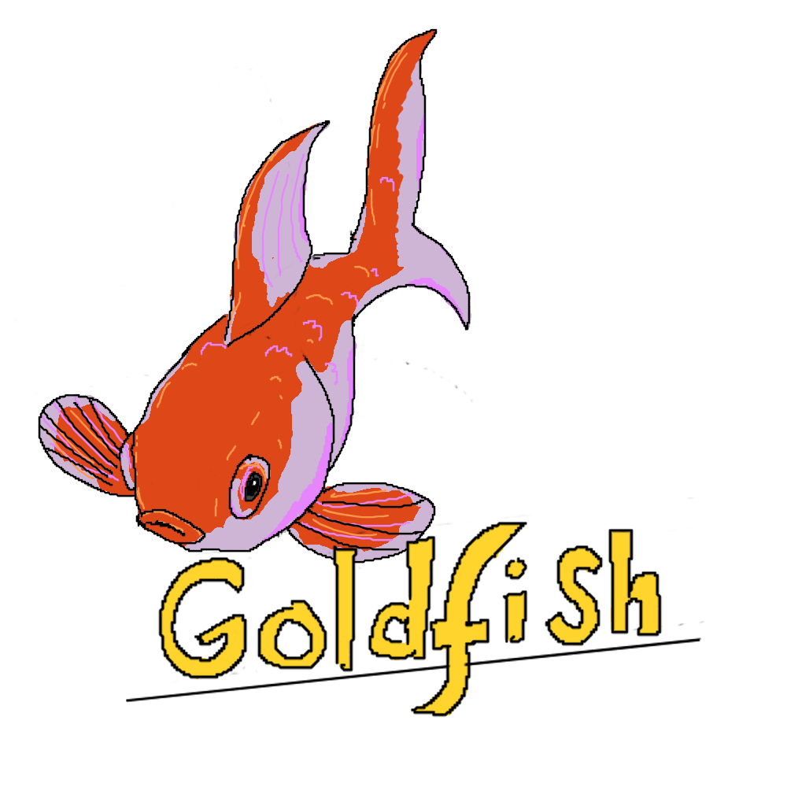

# Goldfish  

Goldfish is a framework for building web applications. Goldfish employs a hierarchical event based and type-safe routing system. Its lightweight front controller provides enormous flexibility without getting in the way of design.
